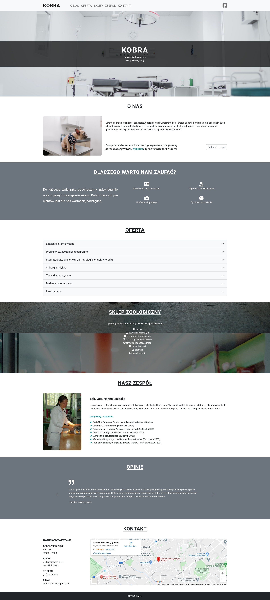

# Kobra - veterinary clinic website

This is a website I made for a veterinary clinic. The main concept was to create a simple but clean and elegant single page website, which will cover all the necessary information about the clinic. The goal was also to mainly use Bootstrap classes and keep the SCSS file simple.

## Overview

### Screenshot

### Links

- Live Site URL: [HERE](https://radoslawlagan.github.io/Kobra-website/)

## My process

### Built with

- HTML5
- SASS (SCSS)
- Bootstrap 5
- JS
